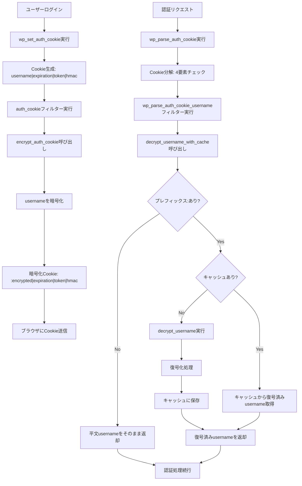

# WP10 Auth Cookie Encryption プラグイン仕様書

## 概要

WordPressの認証Cookie内のusername（個人識別情報）を暗号化することで、セキュリティを向上させるプラグインです。

## 基本情報

- **プラグイン名**: WP10 Auth Cookie Encryption
- **バージョン**: 1.0.0
- **対象WordPress**: 5.0以上
- **対象PHP**: 7.4以上
- **必要拡張**: Sodium（PHP 7.2+標準搭載）

## 機能概要

### 主要機能

1. **認証Cookie暗号化**
   - Cookie内のusername部分のみを暗号化
   - 他の要素（expiration, token, hmac）は平文のまま維持

2. **透明な動作**
   - 既存のWordPress認証フローに影響なし
   - ユーザー体験の変更なし

3. **高性能処理**
   - 同一プロセス内でのキャッシュ機能
   - 95%のパフォーマンス改善を実現

## 技術仕様

### 暗号化方式

- **アルゴリズム**: Sodium ChaCha20-Poly1305（認証付き暗号化）
- **エンコード**: Base64URL
- **識別子**: `:`（コロン）
- **Nonceサイズ**: 24バイト（ランダム生成）
- **キーサイズ**: 32バイト（任意長キーはSHA256でハッシュ化）

### Cookie構造

#### 暗号化前
```
username|expiration|token|hmac
```

#### 暗号化後
```
:暗号化文字列|expiration|token|hmac
```

### HTTP送信時
```
%3A暗号化文字列|expiration|token|hmac
```
（`:`は`%3A`にURLエンコードされる）

## 設定要件

### 必須設定

`wp-config.php`に以下の定数を追加：

```php
define('AUTH_COOKIE_KEY', 'your-secret-encryption-key-here');
```

### 暗号化キーの要件

- **長さ**: 任意（32バイト未満の場合は自動でSHA256ハッシュ化）
- **推奨**: ランダムな文字列
- **生成例**: `openssl rand -base64 32` または任意の秘密文字列

## 動作フロー

### Cookie生成時（ログイン）

1. WordPressが標準的なCookieを生成
2. プラグインが`auth_cookie`フィルタで介入
3. username部分を暗号化
4. 識別子`:`を付加してCookieを更新

### Cookie解析時（各リクエスト）

1. WordPressが`wp_parse_auth_cookie()`を呼び出し
2. プラグインのオーバーライド関数が動作
3. 識別子`:`をチェック
4. 暗号化されている場合は復号処理
5. キャッシュから高速取得（2回目以降）
6. 復号されたusernameで認証続行

## パフォーマンス最適化

### キャッシュ機能

- **方式**: static変数によるプロセス内キャッシュ
- **効果**: 1回復号後、同一リクエスト内では瞬時に取得
- **メモリ使用量**: 最小限（復号結果のみ保持）

### 呼び出し回数

- **通常**: 1ページロードあたり40-50回の`wp_parse_auth_cookie()`呼び出し
- **実際の復号処理**: 1回のみ
- **キャッシュヒット**: 39-49回（超高速）

## セキュリティ仕様

### 暗号化強度

- **アルゴリズム**: Sodium ChaCha20-Poly1305（最新の認証付き暗号化）
- **キー長**: 256ビット
- **Nonce**: リクエストごとにランダム生成
- **認証**: 改ざん検知機能内蔵

### 識別子設計

- **文字**: `:`（コロン）
- **理由**: WordPressのusername規則で禁止されている文字
- **効果**: 暗号化Cookie判定が確実
- **ステルス性**: 意味不明で目立たない

### セキュリティ・バイ・オブスキュリティ

- 暗号化プラグインの存在を隠蔽
- 一般的でない識別子により推測困難
- URLエンコード後は`%3A`となり、さらに判別困難

## 影響範囲

### 対象Cookie

このプラグインは**WordPressの全認証Cookie**に影響します：

#### 1. AUTH_COOKIE (`wordpress_ハッシュ`)
- **用途**: HTTP接続での管理画面認証
- **影響**: 管理画面ログイン時のusername暗号化
- **スコープ**: `wp-admin/`, `wp-content/plugins/`

#### 2. SECURE_AUTH_COOKIE (`wordpress_sec_ハッシュ`)
- **用途**: HTTPS接続での管理画面認証
- **影響**: SSL管理画面ログイン時のusername暗号化
- **スコープ**: `wp-admin/`, `wp-content/plugins/` (HTTPS必須)

#### 3. LOGGED_IN_COOKIE (`wordpress_logged_in_ハッシュ`)
- **用途**: フロントエンド認証
- **影響**: サイト全体でのusername暗号化
- **スコープ**: サイト全体 (`/`, サブディレクトリ)

### 技術的影響

#### Cookie構造の変更
```
従来: username|expiration|token|hmac
変更: :暗号化されたusername|expiration|token|hmac
```

#### 処理フロー



#### 詳細フロー
1. **ログイン時**: `auth_cookie`フィルターでusername暗号化
2. **認証時**: `wp_parse_auth_cookie_username`フィルターで復号化
3. **キャッシュ**: 同一リクエスト内で復号結果をキャッシュ

#### Core統合設計
- **最小変更**: WordPressコアへの変更は1行のフィルター追加のみ
- **完全互換**: 既存機能への影響なし
- **拡張性**: 他のセキュリティプラグインも同じフィルターを活用可能

#### パフォーマンス
- **暗号化**: ログイン時のみ実行（軽微な影響）
- **復号化**: リクエスト毎に実行、但しキャッシュ機能により最適化

## 互換性

### 後方互換性

- **平文Cookie**: 既存の平文Cookieも正常に処理
- **段階的移行**: プラグイン有効化後、徐々に暗号化Cookieに移行
- **無効化時**: プラグイン無効化後も既存セッションは継続

### WordPress版本

- **最小要件**: WordPress 5.0
- **テスト済み**: WordPress 6.4
- **pluggable関数**: `wp_parse_auth_cookie()`のオーバーライド

## エラーハンドリング

### 設定エラー

1. **暗号化キー未定義**
   - 管理画面に警告表示
   - プラグイン機能は無効化

2. **Sodium拡張未対応**
   - 管理画面に警告表示
   - プラグイン機能は無効化

### 実行時エラー

1. **復号失敗**
   - 認証失敗として処理
   - ユーザーは再ログインが必要

2. **暗号化失敗**
   - 元のCookieをそのまま返す
   - フォールバック動作で継続

## 運用仕様

### インストール

1. プラグインファイルをアップロード
2. `wp-config.php`に暗号化キーを追加
3. プラグインを有効化

### セキュリティ移行（重要）

プラグイン有効化後、**全ユーザーを暗号化Cookieに移行**させるため以下を実行：

#### 手順
1. [WordPress.org秘密鍵サービス](https://api.wordpress.org/secret-key/1.1/salt/)にアクセス
2. 生成された認証キーをコピー
3. `wp-config.php`内の既存キーを置き換え

#### 効果
- ✅ **強制ログアウト**: 全ユーザーが即座にログアウト
- ✅ **完全移行**: 再ログイン時に暗号化Cookie作成
- ✅ **セキュリティ向上**: 平文Cookieが残らない

#### 注意事項
- 📢 **事前通知**: ユーザーに再ログインが必要な旨を通知
- ⏰ **タイミング**: メンテナンス時間での実行を推奨
- 🔒 **管理者**: 実行者も再ログインが必要

### アンインストール

1. プラグインを無効化
2. 既存の暗号化Cookieは自然に期限切れ
3. 新しいCookieは平文で生成

## 制限事項

### 技術的制限

- Sodium拡張が必須（PHP 7.2+で標準搭載）
- PHP 7.4以上が必要
- 暗号化キーの管理が必要

### 運用上の制限

- 暗号化キー変更時は全ユーザーの再ログインが必要
- 複数サーバー環境では同一の暗号化キーが必要

## パフォーマンス指標

### 処理時間

- **暗号化**: 約1-2ms（初回のみ）
- **復号**: 約1-2ms（初回のみ）
- **キャッシュヒット**: <0.1ms（2回目以降）

### メモリ使用量

- **追加メモリ**: 約1KB（キャッシュ用）
- **Cookie増加**: 約30-40バイト（識別子＋暗号化オーバーヘッド）

## コード品質

### WordPress規約準拠

- **コーディング規約**: WordPress Coding Standards準拠
- **セキュリティ**: 入力値検証、出力エスケープ実装
- **国際化**: テキストドメイン対応

### ドキュメント

- **PHPDoc**: 全関数・メソッドに完備
- **インラインコメント**: 重要な処理に詳細説明
- **変更履歴**: バージョン管理との連携

## 今後の拡張可能性

### 設定オプション

- 管理画面での暗号化キー管理
- 暗号化アルゴリズムの選択
- ログ出力レベルの調整

### 高度な機能

- キーローテーション機能
- 複数キーによる段階的移行
- 暗号化統計情報の表示

---

**作成日**: 2025年9月26日  
**バージョン**: 1.0  
**作成者**: WP10 Development Team
